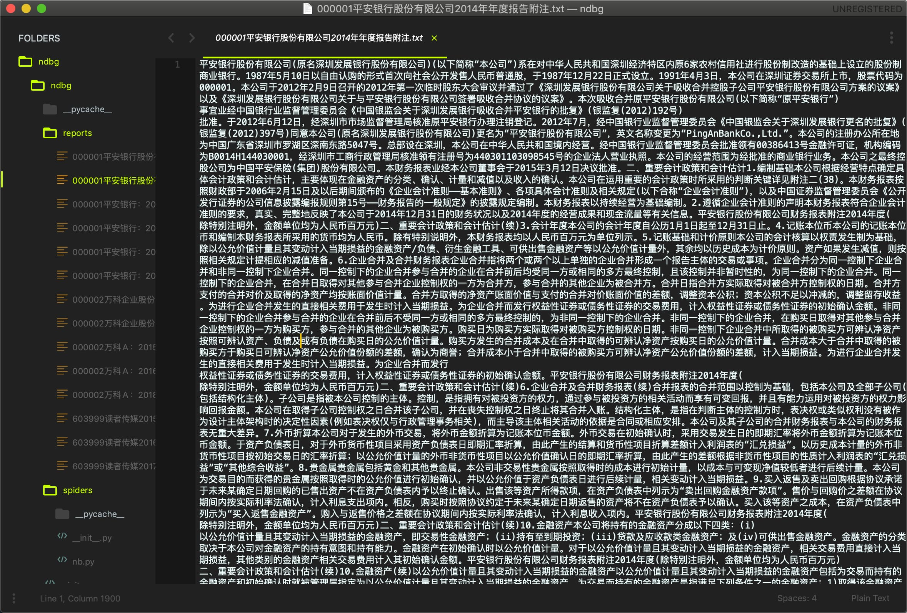
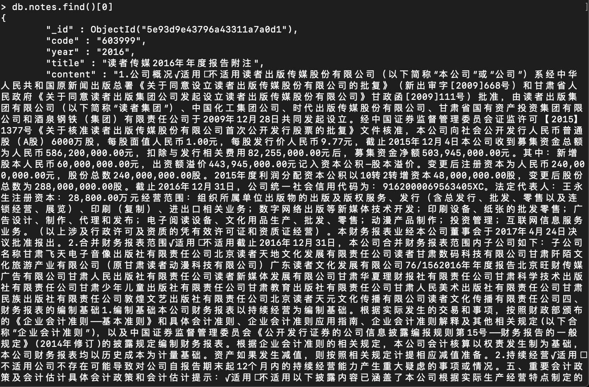

### 前言

由于某些原因，我需要下载一些公司的年报报告，并且将其转换为纯文本以便进行文本分析，具体地说，我需要3000家上市公司2013年到2018年的文本格式年报。

在此之前我编写了两个程序，一个用来下载新浪财经的PDF格式年报，另一个实现PDF转txt的功能，但是这并不现实。

一是因为我的电脑和服务器都没有那么大的内存来存储这些PDF格式的年报；二是因为PDF转txt的效率很慢，也许到我开学也做不完这些任务，所以我就放弃了之前的程序。一直搁置到现在。

直到昨天，我才发现原来网易财经已经把PDF格式的年报转成了txt格式，那么一切都变得简单许多了。

### 数据来源

网易财经：http://quotes.money.163.com

### 程序的一些说明

#### 如何运行

进入项目根目录，在终端或者cmd里运行`scrapy crawl nb`即可，前提是安装好环境

#### 如何修改年份

修改`nb.spider`中的`year_list`

#### 如何修改股票代码

替换`ndbg/ndbg/stkcd.txt`中的内容

#### 如何采集报告全文

我只需要附注，所以默认只采集附注，如果要采集全文，请参考`nb.spider`中`parse_report`的注释

#### 如何修改存储方式

我在pipeline中设置了两种存储方式，一种是将item存储到mongodb中，另一种是直接存储为`ndbg/ndbg/report`文件夹下的txt文件，我想正常人应该不需要两种同时使用，所以请您按照实际情况注释掉一种。

### 效果

#### 存储为txt

#### 存储到mongodb

